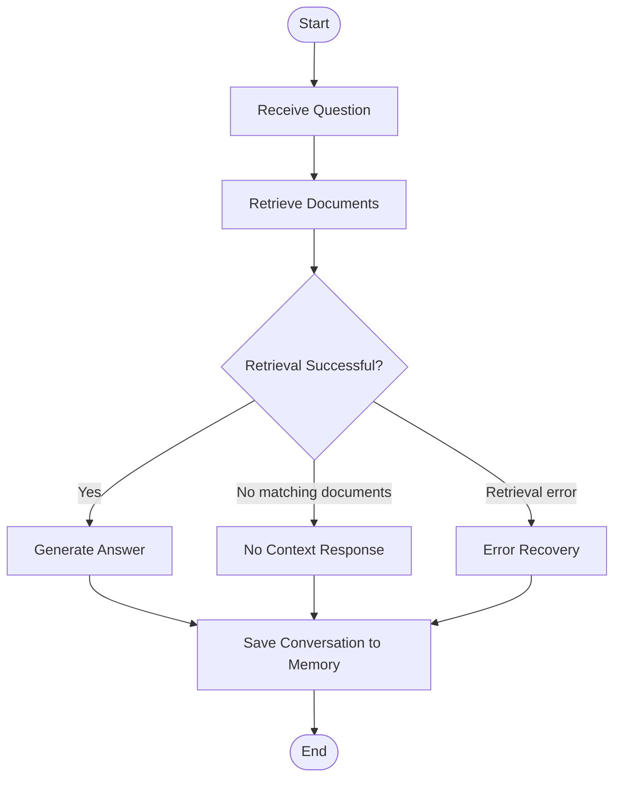

# Updated LangGraph Workflow Diagram

```mermaid
flowchart TD
    A([Start]) --> B[Receive Question]
    B --> C[Retrieve Documents]
    C --> D{Retrieval Successful?}

    D -->|Yes| E[Generate Answer]
    D -->|No matching documents| F[No Context Response]
    D -->|Retrieval error| G[Error Recovery]

    E --> H[Save Conversation to Memory]
    F --> H
    G --> H

    H --> I([End])
```
